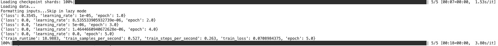

### Qwen-VL-Lora-Model


使用V100的卡对Qwen-VL进行Lora微调，微调过程中产生各种报错，解决报错后可以成功运行，将成功运行的模型上传供参考




#### 1、fineturn.py

经过debug调试，发现device_map为none，修改获取device_map方式如下

```
device_map = {"": int(os.environ.get("LOCAL_RANK") or 0)}
```

注释掉GPTQ量化的代码

```
model = transformers.AutoModelForCausalLM.from_pretrained(
        model_args.model_name_or_path,
        config=config,
        cache_dir=training_args.cache_dir,
        device_map=device_map,
        trust_remote_code=True,
        #quantization_config=GPTQConfig(
        #    bits=4, disable_exllama=True
        #)
        #if training_args.use_lora and lora_args.q_lora
        #else None,
    )

```

#### 2、finetune_lora_single_gpu.sh

由于会报半精度的错误 "erfinv_vml_cpu" not implemented for 'Half' ，因此需要设置 --fp16 False

```
CUDA_VISIBLE_DEVICES='0' python finetune.py \
    --model_name_or_path $MODEL \
    --data_path $DATA \
    --fp16 False \
    --fix_vit True \
    --output_dir output_lora_model \
    --num_train_epochs 5 \
    --per_device_train_batch_size 2 \
    --per_device_eval_batch_size 1 \
    --gradient_accumulation_steps 8 \
    --evaluation_strategy "no" \
    --save_strategy "steps" \
    --save_steps 1000 \
    --save_total_limit 10 \
    --learning_rate 1e-5 \
    --weight_decay 0.1 \
    --adam_beta2 0.95 \
    --warmup_ratio 0.01 \
    --lr_scheduler_type "cosine" \
    --logging_steps 1 \
    --report_to "none" \
    --model_max_length 2048 \
    --lazy_preprocess True \
    --gradient_checkpointing \
    --use_lora
```


